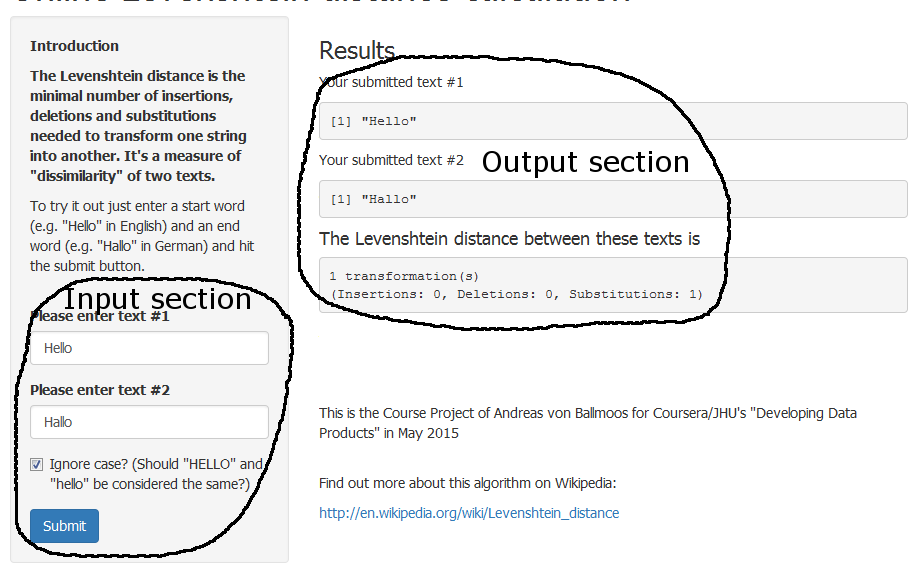

Online Levenshtein distance calculator 
========================================================
author: Andreas von Ballmoos
date: May 2015
Course Project for Johns Hopkins University's "Developing Data Products" on Coursera

Motivation
========================================================

In my work for Switzerland's leading provider of online marketplaces, we often stumble over the question what "similar items" are. This is an important topic when we talk about fraud detection, auto correction or recommender systems.

One of many indicators for questions like these may be the similarity of two texts, e.g. an item's manufacturer or its description.

The Levenshtein distance is a concept to measure text dissimilarity. It counts the **minimal number of insertions, deletions and substitutions needed to transform one string into another**.

My course project Shiny app is an online calculator to figure out the Levenshtein distance between two texts.

The R implementation of the Levenshtein distance
========================================================
In the R package "utils", the algorithm to calculate the Levenshtein distance is implemented in a function called "adist".

Here's a simple example. We can transform "Hello" to "Hallo" with one substitution:

```r
text1="Hello" #User input 1
text2="Hallo" #User input 2

distance=adist(text1,text2) #call the function in package "utils"

distance[1] #result/output on web page
```

```
[1] 1
```

This is what the server.R part of the Shiny app does.

The Online Levenshtein Distance Calculator
========================================================



https://axxando.shinyapps.io/DataProductsProject/

Further reading
========================================================

The Levenshtein distance & its implementation in the "utils" package
- http://en.wikipedia.org/wiki/Levenshtein_distance
- https://stat.ethz.ch/R-manual/R-devel/library/utils/html/adist.html

